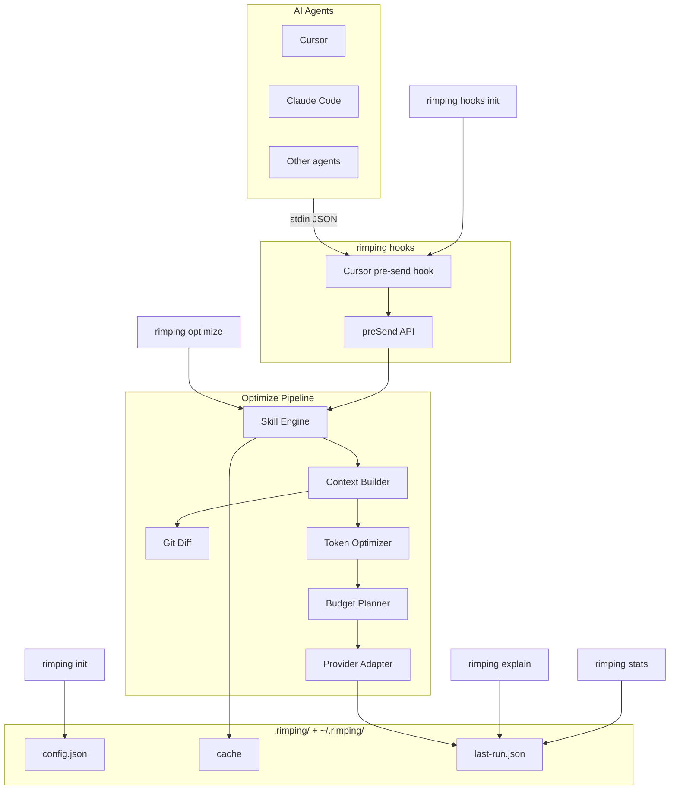

# Architecture

This document describes how Rimping is structured internally — the optimization pipeline, module boundaries, and data flow.

## High-Level Overview

Rimping is a Bun + TypeScript monorepo with two packages:

```
rimping/
├── packages/
│   ├── cli/          @rimping/cli   — CLI commands (citty)
│   └── core/         @rimping/core  — optimization engine
├── skills/           bundled prompt skills (Markdown)
├── .cursor/          Cursor hook integration (example)
└── turbo.json        build orchestration
```

## System Overview

Rimping is a **prompt optimizer** — it compresses and enriches prompts before they reach an LLM. It is not a codebase indexer: there is no retrieval, vector database, or `index` command.

When an agent submits a prompt (e.g. Cursor via the `beforeSubmitPrompt` hook), data flows: stdin JSON → hook script → `preSend()` → `optimize()` pipeline → results persisted as JSON files.



**Notes:** Git Diff is a sub-step of Context Builder, not a separate pipeline stage. Claude and other agents have no bundled hook template — integrate via the `preSend()` API or `rimping optimize` CLI. Provider Adapter formats output for LLM providers, not agent transport.

## Optimization Pipeline

Every `optimize` call flows through five stages:


### Stage 1: Skill Engine

**Module:** `packages/core/src/skill-engine.ts`

1. `loadSkills(cwd)` — scans `./skills/` and `~/.rimping/skills/`, parses Markdown frontmatter
2. `selectSkills()` — picks skills by explicit `--skills` IDs or `autoDetectSkills()` keyword matching
3. `composeSkills()` — prepends skill rules/transformation instructions to the prompt

Skills are ranked by `priority`. User-level skills (`~/.rimping/skills/`) override project skills with the same `id`.

### Stage 2: Context Builder

**Module:** `packages/core/src/context-builder.ts`

Enriches the skilled prompt with optional context:

| Source | Trigger | Behavior |
|--------|---------|----------|
| Git diff | `diff: true` | Fetches unified diff, compresses hunks, injects as `## Changes` |
| Files | `files: string[]` | Reads file contents (max 200 lines each), injects as `## Files` |
| Memory | always (mock) | Injects relevant memory entries as `## Memory` |

Git diff enrichment (`packages/core/src/git-diff/`):

```
fetchGitDiff → parseUnifiedDiff → compressHunks → enrich with tree-sitter symbols
```

Compression strategies for diffs:
- `filter-files` — skip lockfiles, binaries, generated files
- `strip-context` — remove unchanged context lines
- `merge-hunks` — merge adjacent hunks in the same file
- `budget-trim` — trim to token budget

### Stage 3: Token Optimizer

**Module:** `packages/core/src/optimizer.ts`

Applies a chain of deterministic text strategies:

| Strategy | Effect |
|----------|--------|
| `normalize-whitespace` | Trim trailing spaces, collapse blank lines |
| `remove-filler` | Strip polite phrases ("please", "could you", etc.) |
| `dedupe-lines` | Remove consecutive duplicate lines |
| `compress-code-comments` | Strip comments inside fenced code blocks |
| `collapse-lists` | Merge adjacent list items with same prefix |

Each strategy records token before/after in `explain` steps. Strategies only apply when they reduce token count.

### Stage 4: Budget Planner

**Module:** `packages/core/src/budget-planner.ts`

Enforces `maxTokens` cap via `truncateTail()` — removes content from the end while preserving structure. Reports a `budgetGuard` when truncation occurs.

### Stage 5: Provider Adapter

**Module:** `packages/core/src/adapters/`

Formats the final output for the target LLM provider:

| Adapter | Provider |
|---------|----------|
| `OpenAIAdapter` | OpenAI chat format |
| `ClaudeAdapter` | Anthropic Claude format |
| `GeminiAdapter` | Google Gemini format |
| `MockAdapter` | Pass-through (testing) |

## Caching

**Module:** `packages/core/src/cache.ts`

- Cache directory: `~/.rimping/cache/`
- Key: SHA-256 hash of `prompt + skills + diff + maxTokens + cwd`
- TTL: 24 hours
- Bypass with `useCache: false` or CLI `--no-cache`

Last run metadata is persisted to `~/.rimping/last-run.json` for `stats` and `explain` commands.

## Configuration System

**Modules:** `config.ts`, `config-init.ts`, `resolve-options.ts`

```
.rimping/config.json
       ↓
  loadConfig(cwd)
       ↓
  resolveOptimizeOptions()  — merges CLI flags > config > defaults
       ↓
  optimize(options)
```

`resolve-options.ts` also merges `hooks` config for the `preSend` hook path.

## Agent Detection

**Module:** `packages/core/src/agent-detect.ts`

`detectAgents(cwd)` probes the filesystem and PATH for known AI coding tools. `runDoctor(cwd)` combines agent detection with config validation and agent skill presence checks.

## Hook Integration

**Module:** `packages/core/src/hooks/pre-send.ts`

The `preSend()` function is the hook entry point:

```
preSend(prompt)
  → loadConfig + mergeHooksConfig
  → skip if disabled / too short
  → optimize(prompt)
  → skip if savings < minSavingsPercent
  → return optimized text (or original on error — fail open)
```

CLI `hooks init` copies templates from `packages/cli/templates/cursor-hooks/` into `.cursor/hooks/`.

## CLI Layer

**Package:** `@rimping/cli`

Built with [citty](https://github.com/unjs/citty). Commands map directly to core functions:

| Command | Core module |
|---------|-------------|
| `init` | `config-init.ts` |
| `doctor` | `agent-detect.ts` |
| `optimize` | `pipeline.ts` |
| `stats` | `cache.ts`, `pipeline.ts` |
| `explain` | `pipeline.ts` |
| `skills init` | `agent-skills-init.ts` |
| `hooks init` | `hooks-init.ts` |

## Type System

Key types in `packages/core/src/types.ts`:

```typescript
interface OptimizeOptions {
  prompt: string
  skills?: string[]
  diff?: boolean
  maxTokens?: number
  provider?: ProviderName
  cwd?: string
  useCache?: boolean
  autoDetectSkills?: boolean
  files?: string[]
}

interface OptimizeResult {
  optimized: string
  stats: OptimizationStats
  explain: ExplainStep[]
}
```

## Token Estimation

**Module:** `packages/core/src/tokenizer.ts`

Uses a character-based heuristic (`~4 chars per token`) for fast, dependency-free estimation. Suitable for relative savings measurement, not billing-grade accuracy.

## Extension Points

| Extension | How |
|-----------|-----|
| Prompt skill | Add `skills/<id>.md` with frontmatter |
| Agent skill | Add `.agents/skills/<name>/SKILL.md` |
| Provider adapter | Implement `LLMProvider` in `adapters/` |
| Optimizer strategy | Add to `strategies[]` in `optimizer.ts` |
| Memory store | Implement `MemoryStore` interface |
| Hook integration | Call `preSend()` from your editor hook |

## Build & Test

- **Build:** Turbo monorepo — `bun run build` compiles both packages
- **Tests:** Bun test runner — `packages/core/test/` mirrors `src/`
- **Typecheck:** `bun run typecheck` across all packages
