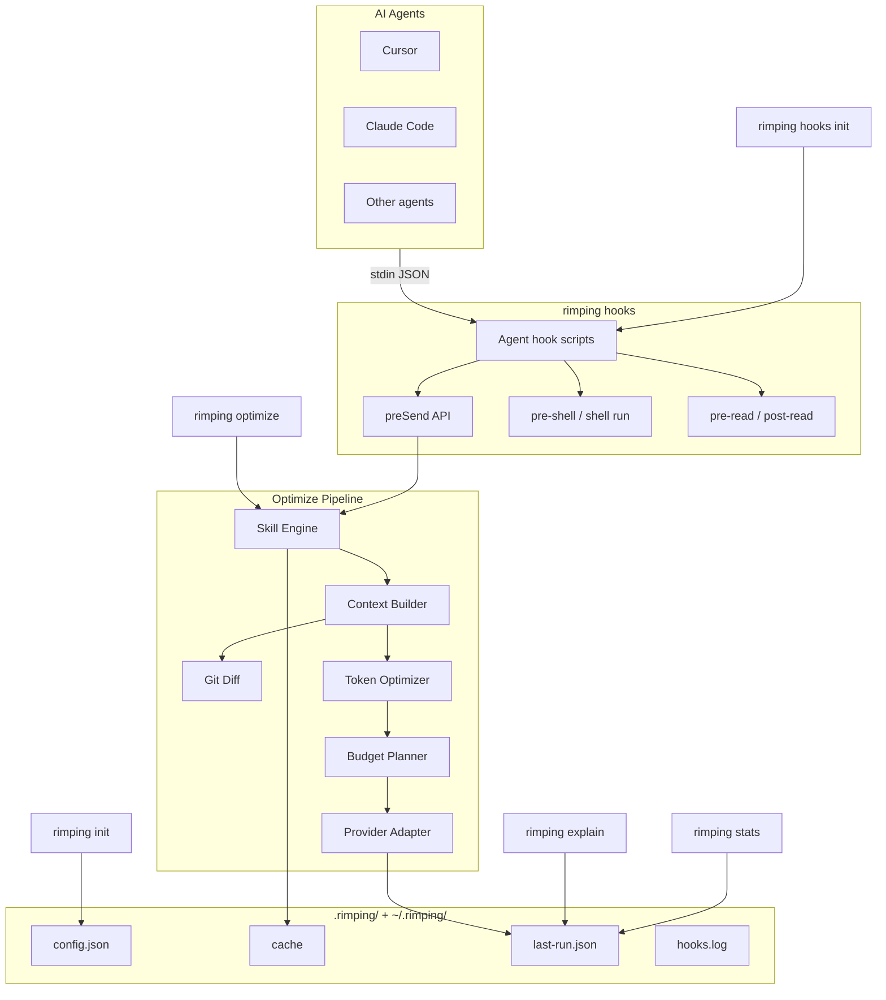

# Architecture

This document describes how Rimping is structured internally — the optimization pipeline, module boundaries, and data flow.

## High-Level Overview

Rimping is a Bun + TypeScript monorepo:

```
rimping/
├── packages/
│   ├── cli/          @rimping/cli   — CLI commands (citty)
│   └── core/         @rimping/core  — optimization engine
├── docs/             VitePress documentation site
├── benchmarks/       comparison harness
└── turbo.json        build orchestration
```

## System Overview

Rimping is a **prompt optimizer** — it compresses and enriches prompts before they reach an LLM. It is not a codebase indexer: there is no retrieval, vector database, or `index` command.

When an agent submits a prompt (e.g. Cursor via the `beforeSubmitPrompt` hook), data flows: stdin JSON → hook script → `preSend()` → `optimize()` pipeline → results persisted as JSON files.



**Notes:** Git Diff is a sub-step of Context Builder, not a separate pipeline stage. `rimping init` scaffolds hook files for Cursor, Claude Code, Codex, Gemini, Copilot, Windsurf, and Antigravity. Provider Adapter formats output for LLM providers, not agent transport.

## Optimization Pipeline

Every `optimize` call flows through five stages:


### Stage 1: Skill Engine

**Module:** `packages/core/src/skill-engine.ts`

1. `loadSkills(cwd)` — scans `./skills/` and `~/.rimping/skills/`, parses Markdown frontmatter
2. `selectSkills()` — explicit `--skills` / `defaultSkills` IDs, else `autoDetectSkills()` keyword matching, else none
3. `composeSkills()` — applies skill transformation rules to the prompt

Skills are ranked by `priority`. User-level skills (`~/.rimping/skills/`) override project skills with the same `id`.

### Stage 2: Context Builder

**Module:** `packages/core/src/context-builder.ts`

Enriches the skilled prompt with optional context:

| Source | Trigger | Behavior |
|--------|---------|----------|
| Git diff | `diff: true` | Fetches unified diff, compresses hunks, injects as `## Changes` |
| Files | `files: string[]` | Reads file contents (max 200 lines each), injects as `## Files` |
| Memory | always (mock) | Injects relevant memory entries as `## Memory` |

Git diff enrichment (`packages/core/src/git-diff/`):

```
fetchGitDiff → parseUnifiedDiff → compressHunks → enrich with tree-sitter symbols
```

Compression strategies for diffs:
- `filter-files` — skip lockfiles, binaries, generated files
- `strip-context` — remove unchanged context lines
- `merge-hunks` — merge adjacent hunks in the same file
- `budget-trim` — trim to token budget

### Stage 3: Token Optimizer

**Module:** `packages/core/src/optimizer.ts`

Applies a chain of deterministic text strategies:

| Strategy | Effect |
|----------|--------|
| `normalize-whitespace` | Trim trailing spaces, collapse blank lines |
| `remove-filler` | Strip polite phrases ("please", "could you", etc.) |
| `dedupe-lines` | Remove consecutive duplicate lines |
| `compress-code-comments` | Strip comments inside fenced code blocks |
| `collapse-lists` | Merge adjacent list items with same prefix |

Each strategy records token before/after in `explain` steps. Strategies only apply when they reduce token count.

### Stage 4: Budget Planner

**Module:** `packages/core/src/budget-planner.ts`

Enforces `maxTokens` cap via `truncateTail()` — removes content from the end while preserving structure. Reports a `budgetGuard` when truncation occurs.

### Stage 5: Provider Adapter

**Module:** `packages/core/src/adapters/`

Formats the final output for the target LLM provider:

| Adapter | Provider |
|---------|----------|
| `OpenAIAdapter` | OpenAI chat format |
| `ClaudeAdapter` | Anthropic Claude format |
| `GeminiAdapter` | Google Gemini format |
| `CopilotAdapter` | GitHub Copilot chat format (user message only) |
| `MockAdapter` | Pass-through (testing) |

## Caching

**Module:** `packages/core/src/cache.ts`

- Cache directory: `~/.rimping/cache/`
- Key: SHA-256 hash of `prompt + skills + diff + maxTokens + cwd`
- TTL: 24 hours
- Bypass with `useCache: false` or CLI `--no-cache`

Last run metadata is persisted to `~/.rimping/last-run.json` for `stats` and `explain` commands.

## Configuration System

**Modules:** `config.ts`, `config-init.ts`, `resolve-options.ts`

```
~/.rimping/config.json  (global)
       +
.rimping/config.json    (project — wins on conflict)
       ↓
  loadConfig(cwd)
       ↓
  resolveOptimizeOptions()  — merges CLI flags > config > defaults
  resolveShellOptions()     — merges shell config
  resolveReadOptions()      — merges read config
  mergeHooksConfig()        — top-level hooks + per-agent overrides + enabled
       ↓
  optimize() / preSend() / compressShellOutput() / compressReadContent()
```

Config is stored compactly: top-level `hooks` holds defaults for all agents; `agents.<id>` usually only sets `enabled`. Per-agent `hooks` blocks are written only when they differ from the top-level defaults (`compactAgentConfig` in `config-init.ts`).

`mergeHooksConfig(config, agentId)` in `resolve-options.ts` applies, in order: built-in defaults → top-level `hooks` → `agents.<id>.hooks` → `agents.<id>.enabled === false` forces `hooks.enabled` off.

## Agent Detection

**Module:** `packages/core/src/agent-detect.ts`

`detectAgents(cwd)` probes the filesystem and PATH for known AI coding tools. `runDoctor(cwd)` combines agent detection with config validation, agent skill checks, and Cursor hook registration (pre-send, pre-shell, pre-read, post-read).

## Hook Integration

**Modules:** `packages/core/src/hooks/`, `packages/core/src/hooks-init.ts`, `packages/cli/templates/agent-hooks/`

Rimping wires four hook entry points into each supported agent:

| CLI command | Purpose |
|-------------|---------|
| `rimping hooks pre-send` | Prompt optimization via `preSend()` |
| `rimping hooks pre-shell` | Rewrite shell/bash commands to `rimping shell run` |
| `rimping hooks pre-read` | Inject line limits before file reads |
| `rimping hooks post-read` | Compress file content after reads |

The `preSend()` function is the prompt hook entry point:

```
preSend(prompt)
  → loadConfig + mergeHooksConfig (per-agent overrides)
  → skip if disabled / too short
  → optimize(prompt)
  → skip if savings < minSavingsPercent
  → return optimized text (or original on error — fail open)
```

`rimping init` and `rimping hooks init` copy per-agent templates from `packages/cli/templates/agent-hooks/` into the paths defined in `agent-hook-specs.ts`. Merge strategies vary by agent (`replace`, `merge-hooks`, `merge-named-hooks`) to preserve existing hook configuration.

## Shell Output Compression

**Module:** `packages/core/src/shell-output/`

`compressShellOutput(command, raw)` compresses terminal output before it enters agent context:

```
git status / cargo test / rg → command-specific filter → generic (ansi, dedupe) → budget-trim
```

The `pre-shell` hook rewrites agent shell tool calls to route through `rimping shell run`.

## File Read Compression

**Module:** `packages/core/src/file-read/`

Read hooks intercept agent file-read tool calls:

```
pre-read  → inject maxLines limit (autoLimit)
post-read → compressReadContent (strip comments, trim lines, budget-trim)
```

`compressReadContent()` applies generic whitespace cleanup, optional comment stripping for code files, line trimming, and token budget enforcement. Controlled by the `read` section in config.

## Hook Logging

**Module:** `packages/core/src/hooks/log.ts`

When `hooks.logStats` is enabled, each hook run appends a JSON line to `.rimping/hooks.log` with prompt preview, pipeline explain steps, token savings, and agent inference. `rimping hooks log` and `rimping stats` consume this data.

## Self-Update

**Module:** `packages/core/src/self-update.ts`

`rimping update` detects install source (GitHub checkout vs npm), compares versions, and runs `runSelfUpdate()`. Supports `--check` and `--dry-run`.

## CLI Layer

**Package:** `@rimping/cli`

Built with [citty](https://github.com/unjs/citty). Commands map directly to core functions:

| Command | Core module |
|---------|-------------|
| `init` | `config-init.ts`, `hooks-init.ts` |
| `doctor` | `agent-detect.ts` |
| `optimize` | `pipeline.ts` |
| `stats` | `cache.ts`, `pipeline.ts` |
| `explain` | `pipeline.ts` |
| `skills init` | `agent-skills-init.ts` |
| `hooks init` | `hooks-init.ts` |
| `hooks pre-send` | `hooks/pre-send.ts` |
| `hooks pre-shell` | `shell-output/pre-shell.ts` |
| `hooks pre-read` | `file-read/pre-read.ts` |
| `hooks post-read` | `file-read/post-read.ts` |
| `hooks log` | `hooks/log.ts` |
| `shell run` | `shell-output/run.ts` |
| `update` | `self-update.ts` |

## Type System

Key types in `packages/core/src/types.ts`:

```typescript
interface OptimizeOptions {
  prompt: string
  skills?: string[]
  diff?: boolean
  maxTokens?: number
  provider?: ProviderName
  cwd?: string
  useCache?: boolean
  autoDetectSkills?: boolean
  files?: string[]
}

interface OptimizeResult {
  optimized: string
  stats: OptimizationStats
  explain: ExplainStep[]
}
```

## Token Estimation

**Module:** `packages/core/src/tokenizer.ts`

Uses a character-based heuristic (`~4 chars per token`) for fast, dependency-free estimation. Suitable for relative savings measurement, not billing-grade accuracy.

## Extension Points

| Extension | How |
|-----------|-----|
| Prompt skill | Add `skills/<id>.md` with frontmatter |
| Agent skill | Add `.agents/skills/<name>/SKILL.md` |
| Provider adapter | Implement `LLMProvider` in `adapters/` |
| Optimizer strategy | Add to `strategies[]` in `optimizer.ts` |
| Memory store | Implement `MemoryStore` interface |
| Hook integration | Call `preSend()` from your editor hook |

## Build & Test

- **Build:** Turbo monorepo — `bun run build` compiles all packages
- **Docs:** `bun run docs:dev` — VitePress dev server
- **Benchmarks:** `bun run benchmark` — offline comparison harness
- **Tests:** Bun test runner — `packages/core/test/` mirrors `src/`
- **Typecheck:** `bun run typecheck` across all packages
