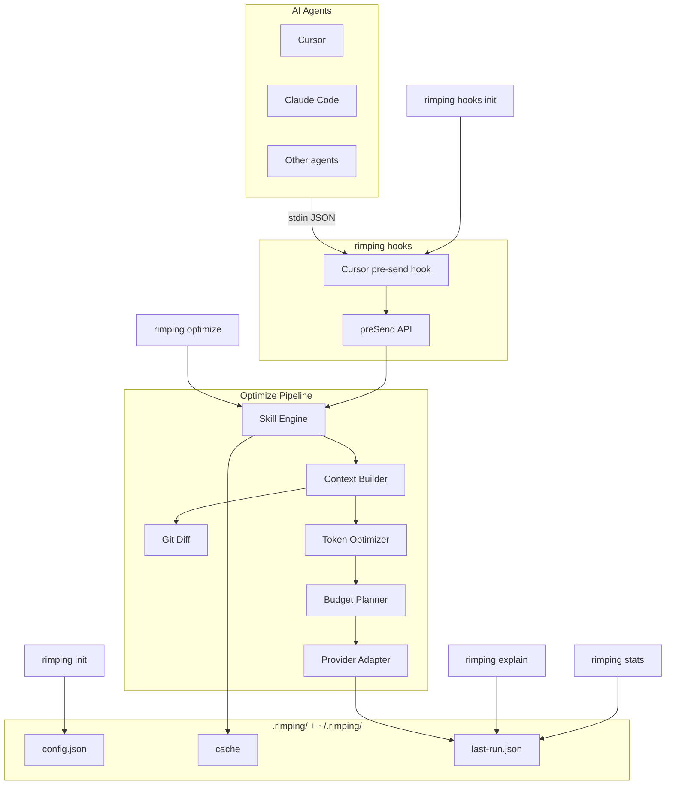

# สถาปัตยกรรม

เอกสารนี้อธิบายโครงสร้างภายในของ Rimping — pipeline การปรับ prompt, ขอบเขตโมดูล และการไหลของข้อมูล

## ภาพรวมระดับสูง

Rimping เป็น monorepo บน Bun + TypeScript มีสองแพ็กเกจหลัก:

```
rimping/
├── packages/
│   ├── cli/          @rimping/cli   — คำสั่ง CLI (citty)
│   └── core/         @rimping/core  — เครื่องมือปรับ prompt
├── skills/           prompt skills ที่มาพร้อม (Markdown)
├── .cursor/          ตัวอย่างการเชื่อมต่อ Cursor hook
└── turbo.json        จัดการ build
```

## ภาพรวมระบบ

Rimping เป็น **prompt optimizer** — บีบอัดและเสริม prompt ก่อนส่งไป LLM ไม่ใช่ codebase indexer ไม่มี retrieval, vector database หรือคำสั่ง `index`

เมื่อ agent ส่ง prompt (เช่น Cursor ผ่าน `beforeSubmitPrompt` hook) ข้อมูลไหลดังนี้: stdin JSON → hook script → `preSend()` → `optimize()` pipeline → บันทึกผลลง JSON files



**หมายเหตุ:** Git Diff เป็น sub-step ของ Context Builder ไม่ใช่ stage แยกใน pipeline จริง Claude และ agent อื่นยังไม่มี hook template ใน repo — เชื่อมได้ผ่าน `preSend()` API หรือ `rimping optimize` CLI Provider Adapter จัดรูปแบบ output สำหรับ LLM provider ไม่ใช่ transport กลับไปยัง agent

## Pipeline การปรับ Prompt

ทุกการเรียก `optimize` ผ่านห้าขั้นตอน:


### ขั้นตอนที่ 1: Skill Engine

**โมดูล:** `packages/core/src/skill-engine.ts`

1. `loadSkills(cwd)` — สแกน `./skills/` และ `~/.rimping/skills/` แยกวิเคราะห์ Markdown frontmatter
2. `selectSkills()` — เลือก skill จาก `--skills` ที่ระบุ หรือ `autoDetectSkills()` จับคู่คำสำคัญ
3. `composeSkills()` — นำกฎและคำแนะนำ transformation ของ skill มาต่อหน้า prompt

Skills จัดอันดับตาม `priority` skill ระดับผู้ใช้ (`~/.rimping/skills/`) จะ override skill โปรเจกต์ที่มี `id` เดียวกัน

### ขั้นตอนที่ 2: Context Builder

**โมดูล:** `packages/core/src/context-builder.ts`

เสริม prompt ที่ผ่าน skill ด้วย context เพิ่มเติม:

| แหล่ง | เงื่อนไข | พฤติกรรม |
|-------|----------|----------|
| Git diff | `diff: true` | ดึง unified diff, บีบอัด hunk, ใส่เป็น `## Changes` |
| ไฟล์ | `files: string[]` | อ่านเนื้อหาไฟล์ (สูงสุด 200 บรรทัดต่อไฟล์) ใส่เป็น `## Files` |
| Memory | เสมอ (mock) | ใส่ memory ที่เกี่ยวข้องเป็น `## Memory` |

การเสริม git diff (`packages/core/src/git-diff/`):

```
fetchGitDiff → parseUnifiedDiff → compressHunks → เสริมด้วย tree-sitter symbols
```

กลยุทธ์บีบอัด diff:
- `filter-files` — ข้าม lockfile, ไบนารี, ไฟล์ที่ generate
- `strip-context` — ลบบรรทัด context ที่ไม่เปลี่ยน
- `merge-hunks` — รวม hunk ที่ติดกันในไฟล์เดียวกัน
- `budget-trim` — ตัดให้อยู่ในงบ token

### ขั้นตอนที่ 3: Token Optimizer

**โมดูล:** `packages/core/src/optimizer.ts`

ใช้กลยุทธ์แปลงข้อความแบบ deterministic ต่อเนื่อง:

| กลยุทธ์ | ผลลัพธ์ |
|---------|---------|
| `normalize-whitespace` | ตัดช่องว่างท้ายบรรทัด, รวมบรรทัดว่าง |
| `remove-filler` | ลบวลีสุภาพ ("please", "could you" ฯลฯ) |
| `dedupe-lines` | ลบบรรทัดซ้ำติดกัน |
| `compress-code-comments` | ลบคอมเมนต์ใน code block |
| `collapse-lists` | รวมรายการที่มี prefix เดียวกัน |

แต่ละกลยุทธ์บันทึก token ก่อน/หลังใน `explain` จะใช้เฉพาะเมื่อลด token ได้จริง

### ขั้นตอนที่ 4: Budget Planner

**โมดูล:** `packages/core/src/budget-planner.ts`

บังคับขีดจำกัด `maxTokens` ผ่าน `truncateTail()` — ตัดจากท้ายโดยรักษาโครงสร้าง รายงาน `budgetGuard` เมื่อมีการตัด

### ขั้นตอนที่ 5: Provider Adapter

**โมดูล:** `packages/core/src/adapters/`

จัดรูปแบบผลลัพธ์สุดท้ายสำหรับ LLM provider:

| Adapter | Provider |
|---------|----------|
| `OpenAIAdapter` | รูปแบบ OpenAI chat |
| `ClaudeAdapter` | รูปแบบ Anthropic Claude |
| `GeminiAdapter` | รูปแบบ Google Gemini |
| `MockAdapter` | ส่งต่อตรง (สำหรับทดสอบ) |

## Cache

**โมดูล:** `packages/core/src/cache.ts`

- ไดเรกทอรี cache: `~/.rimping/cache/`
- คีย์: SHA-256 hash ของ `prompt + skills + diff + maxTokens + cwd`
- อายุ: 24 ชั่วโมง
- ข้ามด้วย `useCache: false` หรือ CLI `--no-cache`

ข้อมูลการรันล่าสุดเก็บที่ `~/.rimping/last-run.json` สำหรับคำสั่ง `stats` และ `explain`

## ระบบ Config

**โมดูล:** `config.ts`, `config-init.ts`, `resolve-options.ts`

```
.rimping/config.json
       ↓
  loadConfig(cwd)
       ↓
  resolveOptimizeOptions()  — รวม CLI flags > config > ค่าเริ่มต้น
       ↓
  optimize(options)
```

`resolve-options.ts` ยังรวม config `hooks` สำหรับเส้นทาง `preSend` hook

## การตรวจจับ Agent

**โมดูล:** `packages/core/src/agent-detect.ts`

`detectAgents(cwd)` ตรวจ filesystem และ PATH หาเครื่องมือ AI coding ที่รู้จัก `runDoctor(cwd)` รวมการตรวจจับ agent กับการตรวจ config และ agent skill

## การเชื่อมต่อ Hook

**โมดูล:** `packages/core/src/hooks/pre-send.ts`

ฟังก์ชัน `preSend()` เป็นจุดเข้า hook:

```
preSend(prompt)
  → loadConfig + mergeHooksConfig
  → ข้ามถ้าปิด / สั้นเกินไป
  → optimize(prompt)
  → ข้ามถ้าประหยัด < minSavingsPercent
  → คืน prompt ที่ปรับแล้ว (หรือเดิมเมื่อ error — fail open)
```

CLI `hooks init` คัดลอก template จาก `packages/cli/templates/cursor-hooks/` ไปยัง `.cursor/hooks/`

## ชั้น CLI

**แพ็กเกจ:** `@rimping/cli`

สร้างด้วย [citty](https://github.com/unjs/citty) คำสั่งเชื่อมกับฟังก์ชัน core โดยตรง:

| คำสั่ง | โมดูล core |
|--------|-----------|
| `init` | `config-init.ts` |
| `doctor` | `agent-detect.ts` |
| `optimize` | `pipeline.ts` |
| `stats` | `cache.ts`, `pipeline.ts` |
| `explain` | `pipeline.ts` |
| `skills init` | `agent-skills-init.ts` |
| `hooks init` | `hooks-init.ts` |

## ระบบ Type

Type หลักใน `packages/core/src/types.ts`:

```typescript
interface OptimizeOptions {
  prompt: string
  skills?: string[]
  diff?: boolean
  maxTokens?: number
  provider?: ProviderName
  cwd?: string
  useCache?: boolean
  autoDetectSkills?: boolean
  files?: string[]
}

interface OptimizeResult {
  optimized: string
  stats: OptimizationStats
  explain: ExplainStep[]
}
```

## การประมาณ Token

**โมดูล:** `packages/core/src/tokenizer.ts`

ใช้ heuristic จากจำนวนตัวอักษร (`~4 ตัวอักษรต่อ token`) เร็วและไม่พึ่ง dependency เหมาะสำหรับวัดการประหยัดเชิงสัมพัทธ์ ไม่ใช่การคิดเงินระดับ billing

## จุดขยาย

| การขยาย | วิธี |
|---------|------|
| Prompt skill | เพิ่ม `skills/<id>.md` พร้อม frontmatter |
| Agent skill | เพิ่ม `.agents/skills/<name>/SKILL.md` |
| Provider adapter | implement `LLMProvider` ใน `adapters/` |
| กลยุทธ์ optimizer | เพิ่มใน `strategies[]` ใน `optimizer.ts` |
| Memory store | implement interface `MemoryStore` |
| Hook integration | เรียก `preSend()` จาก editor hook ของคุณ |

## Build และทดสอบ

- **Build:** Turbo monorepo — `bun run build` compile ทั้งสองแพ็กเกจ
- **ทดสอบ:** Bun test runner — `packages/core/test/` สะท้อนโครงสร้าง `src/`
- **Typecheck:** `bun run typecheck` ทุกแพ็กเกจ
