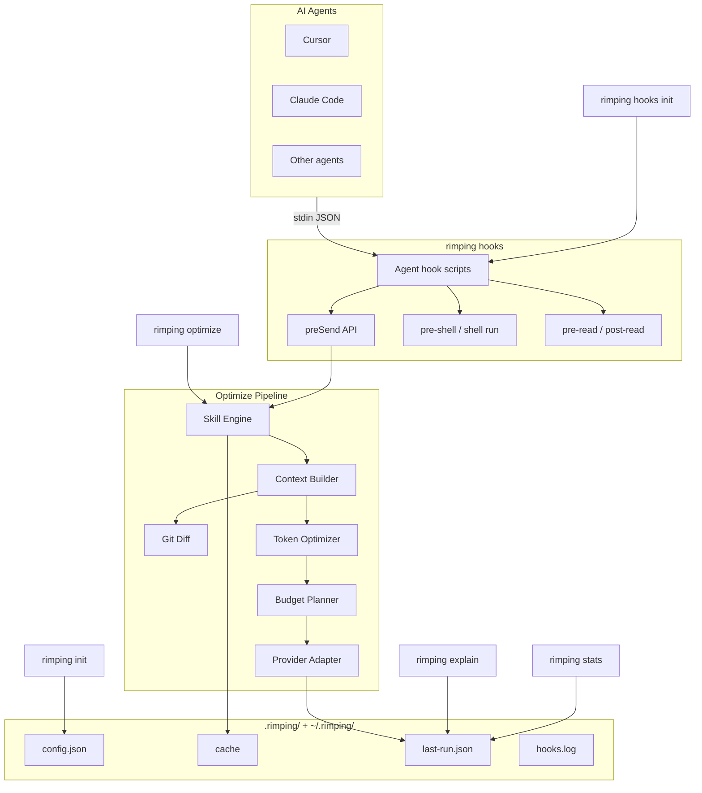

# สถาปัตยกรรม

เอกสารนี้อธิบายโครงสร้างภายในของ Rimping — pipeline การปรับ prompt, ขอบเขตโมดูล และการไหลของข้อมูล

## ภาพรวมระดับสูง

Rimping เป็น monorepo บน Bun + TypeScript:

```
rimping/
├── packages/
│   ├── cli/          @rimping/cli   — คำสั่ง CLI (citty)
│   └── core/         @rimping/core  — เครื่องมือปรับ prompt
├── docs/             เว็บเอกสาร VitePress
└── turbo.json        จัดการ build
```

## ภาพรวมระบบ

Rimping เป็น **prompt optimizer** — บีบอัดและเสริม prompt ก่อนส่งไป LLM ไม่ใช่ codebase indexer ไม่มี retrieval, vector database หรือคำสั่ง `index`

เมื่อ agent ส่ง prompt (เช่น Cursor ผ่าน `beforeSubmitPrompt` hook) ข้อมูลไหลดังนี้: stdin JSON → hook script → `preSend()` → `optimize()` pipeline → บันทึกผลลง JSON files



**หมายเหตุ:** Git Diff เป็น sub-step ของ Context Builder ไม่ใช่ stage แยกใน pipeline จริง `rimping init` สร้างไฟล์ hook สำหรับ Cursor, Claude Code, Codex, Gemini, Copilot, Windsurf และ Antigravity Provider Adapter จัดรูปแบบ output สำหรับ LLM provider ไม่ใช่ transport กลับไปยัง agent

## Pipeline การปรับ Prompt

ทุกการเรียก `optimize` ผ่านห้าขั้นตอน:


### ขั้นตอนที่ 1: Skill Engine

**โมดูล:** `packages/core/src/skill-engine.ts`

1. `loadSkills(cwd)` — สแกน `./skills/` และ `~/.rimping/skills/` แยกวิเคราะห์ Markdown frontmatter
2. `selectSkills()` — `--skills` / `defaultSkills` ที่ระบุ, ไม่เช่นนั้น `autoDetectSkills()` จับคู่คำสำคัญ, ไม่เช่นนั้นไม่ใช้ skill
3. `composeSkills()` — ใช้กฎ transformation ของ skill กับ prompt

Skills จัดอันดับตาม `priority` skill ระดับผู้ใช้ (`~/.rimping/skills/`) จะ override skill โปรเจกต์ที่มี `id` เดียวกัน

### ขั้นตอนที่ 2: Context Builder

**โมดูล:** `packages/core/src/context-builder.ts`

เสริม prompt ที่ผ่าน skill ด้วย context เพิ่มเติม:

| แหล่ง | เงื่อนไข | พฤติกรรม |
|-------|----------|----------|
| Git diff | `diff: true` | ดึง unified diff, บีบอัด hunk, ใส่เป็น `## Changes` |
| ไฟล์ | `files: string[]` | อ่านเนื้อหาไฟล์ (สูงสุด 200 บรรทัดต่อไฟล์) ใส่เป็น `## Files` |
| Memory | เสมอ (mock) | ใส่ memory ที่เกี่ยวข้องเป็น `## Memory` |

การเสริม git diff (`packages/core/src/git-diff/`):

```
fetchGitDiff → parseUnifiedDiff → compressHunks → เสริมด้วย tree-sitter symbols
```

กลยุทธ์บีบอัด diff:
- `filter-files` — ข้าม lockfile, ไบนารี, ไฟล์ที่ generate
- `strip-context` — ลบบรรทัด context ที่ไม่เปลี่ยน
- `merge-hunks` — รวม hunk ที่ติดกันในไฟล์เดียวกัน
- `budget-trim` — ตัดให้อยู่ในงบ token

### ขั้นตอนที่ 3: Token Optimizer

**โมดูล:** `packages/core/src/optimizer.ts`

ใช้กลยุทธ์แปลงข้อความแบบ deterministic ต่อเนื่อง:

| กลยุทธ์ | ผลลัพธ์ |
|---------|---------|
| `normalize-whitespace` | ตัดช่องว่างท้ายบรรทัด, รวมบรรทัดว่าง |
| `remove-filler` | ลบวลีสุภาพ ("please", "could you" ฯลฯ) |
| `dedupe-lines` | ลบบรรทัดซ้ำติดกัน |
| `compress-code-comments` | ลบคอมเมนต์ใน code block |
| `collapse-lists` | รวมรายการที่มี prefix เดียวกัน |

แต่ละกลยุทธ์บันทึก token ก่อน/หลังใน `explain` จะใช้เฉพาะเมื่อลด token ได้จริง

### ขั้นตอนที่ 4: Budget Planner

**โมดูล:** `packages/core/src/budget-planner.ts`

บังคับขีดจำกัด `maxTokens` ผ่าน `truncateTail()` — ตัดจากท้ายโดยรักษาโครงสร้าง รายงาน `budgetGuard` เมื่อมีการตัด

### ขั้นตอนที่ 5: Provider Adapter

**โมดูล:** `packages/core/src/adapters/`

จัดรูปแบบผลลัพธ์สุดท้ายสำหรับ LLM provider:

| Adapter | Provider |
|---------|----------|
| `OpenAIAdapter` | รูปแบบ OpenAI chat |
| `ClaudeAdapter` | รูปแบบ Anthropic Claude |
| `GeminiAdapter` | รูปแบบ Google Gemini |
| `CopilotAdapter` | รูปแบบ GitHub Copilot chat (เฉพาะ user message) |
| `MockAdapter` | ส่งต่อตรง (สำหรับทดสอบ) |

## Cache

**โมดูล:** `packages/core/src/cache.ts`

- ไดเรกทอรี cache: `~/.rimping/cache/`
- คีย์: SHA-256 hash ของ `prompt + skills + diff + maxTokens + cwd`
- อายุ: 24 ชั่วโมง
- ข้ามด้วย `useCache: false` หรือ CLI `--no-cache`

ข้อมูลการรันล่าสุดเก็บที่ `~/.rimping/last-run.json` สำหรับคำสั่ง `stats` และ `explain`

## ระบบ Config

**โมดูล:** `config.ts`, `config-init.ts`, `resolve-options.ts`

```
~/.rimping/config.json  (global)
       +
.rimping/config.json    (โปรเจกต์ — ชนะเมื่อ conflict)
       ↓
  loadConfig(cwd)
       ↓
  resolveOptimizeOptions()  — รวม CLI flags > config > ค่าเริ่มต้น
  resolveShellOptions()     — รวม shell config
  resolveReadOptions()      — รวม read config
  mergeHooksConfig()        — hooks ระดับบน + override ต่อ agent + enabled
       ↓
  optimize() / preSend() / compressShellOutput() / compressReadContent()
```

เก็บ config แบบกระชับ: `hooks` ระดับบนเป็นค่าเริ่มต้นสำหรับทุก agent ส่วน `agents.<id>` ส่วนใหญ่มีแค่ `enabled` บล็อก `hooks` ต่อ agent จะถูกเขียนเฉพาะเมื่อต่างจากค่าเริ่มต้นระดับบน (`compactAgentConfig` ใน `config-init.ts`)

`mergeHooksConfig(config, agentId)` ใน `resolve-options.ts` รวมตามลำดับ: ค่าเริ่มต้นในตัว → `hooks` ระดับบน → `agents.<id>.hooks` → ถ้า `agents.<id>.enabled === false` จะบังคับ `hooks.enabled` เป็น `false`

## การตรวจจับ Agent

**โมดูล:** `packages/core/src/agent-detect.ts`

`detectAgents(cwd)` ตรวจ filesystem และ PATH หาเครื่องมือ AI coding ที่รู้จัก `runDoctor(cwd)` รวมการตรวจจับ agent, config, agent skill และการลงทะเบียน hook ของ Cursor (pre-send, pre-shell, pre-read, post-read)

## การเชื่อมต่อ Hook

**โมดูล:** `packages/core/src/hooks/`, `packages/core/src/hooks-init.ts`, `packages/cli/templates/agent-hooks/`

Rimping เชื่อมสี่จุดเข้า hook ในแต่ละ agent ที่รองรับ:

| คำสั่ง CLI | หน้าที่ |
|-----------|---------|
| `rimping hooks pre-send` | ปรับ prompt ผ่าน `preSend()` |
| `rimping hooks pre-shell` | rewrite คำสั่ง shell/bash เป็น `rimping shell run` |
| `rimping hooks pre-read` | ใส่ขีดจำกัดบรรทัดก่อนอ่านไฟล์ |
| `rimping hooks post-read` | บีบอัดเนื้อหาไฟล์หลังอ่าน |

ฟังก์ชัน `preSend()` เป็นจุดเข้า hook สำหรับ prompt:

```
preSend(prompt)
  → loadConfig + mergeHooksConfig (override ต่อ agent)
  → ข้ามถ้าปิด / สั้นเกินไป
  → optimize(prompt)
  → ข้ามถ้าประหยัด < minSavingsPercent
  → คืน prompt ที่ปรับแล้ว (หรือเดิมเมื่อ error — fail open)
```

`rimping init` และ `rimping hooks init` คัดลอก template ต่อ agent จาก `packages/cli/templates/agent-hooks/` ไปยังตำแหน่งที่กำหนดใน `agent-hook-specs.ts` กลยุทธ์ merge แตกต่างกันตาม agent (`replace`, `merge-hooks`, `merge-named-hooks`) เพื่อรักษา config hook เดิม

## Shell Output Compression

**โมดูล:** `packages/core/src/shell-output/`

`compressShellOutput(command, raw)` บีบอัด terminal output ก่อนเข้า agent context:

```
git status / cargo test / rg → command-specific filter → generic (ansi, dedupe) → budget-trim
```

Hook `pre-shell` rewrite คำสั่ง shell ของ agent ให้ผ่าน `rimping shell run`

## File Read Compression

**โมดูล:** `packages/core/src/file-read/`

Read hook ดักจับการอ่านไฟล์ของ agent:

```
pre-read  → ใส่ขีดจำกัด maxLines (autoLimit)
post-read → compressReadContent (ตัด comment, จำกัดบรรทัด, budget-trim)
```

`compressReadContent()` ทำความสะอาด whitespace, ตัด comment สำหรับไฟล์โค้ด, จำกัดบรรทัด และบังคับงบ token ควบคุมโดยส่วน `read` ใน config

## Hook Logging

**โมดูล:** `packages/core/src/hooks/log.ts`

เมื่อเปิด `hooks.logStats` แต่ละการรัน hook จะ append JSON line ลง `.rimping/hooks.log` พร้อม preview prompt, explain steps, การประหยัด token และ agent ที่อนุมาน `rimping hooks log` และ `rimping stats` อ่านข้อมูลนี้

## Self-Update

**โมดูล:** `packages/core/src/self-update.ts`

`rimping update` ตรวจแหล่งติดตั้ง (GitHub checkout vs npm) เปรียบเทียบเวอร์ชัน และรัน `runSelfUpdate()` รองรับ `--check` และ `--dry-run`

## ชั้น CLI

**แพ็กเกจ:** `@rimping/cli`

สร้างด้วย [citty](https://github.com/unjs/citty) คำสั่งเชื่อมกับฟังก์ชัน core โดยตรง:

| คำสั่ง | โมดูล core |
|--------|-----------|
| `init` | `config-init.ts`, `hooks-init.ts` |
| `doctor` | `agent-detect.ts` |
| `optimize` | `pipeline.ts` |
| `stats` | `cache.ts`, `pipeline.ts` |
| `explain` | `pipeline.ts` |
| `skills init` | `agent-skills-init.ts` |
| `hooks init` | `hooks-init.ts` |
| `hooks pre-send` | `hooks/pre-send.ts` |
| `hooks pre-shell` | `shell-output/pre-shell.ts` |
| `hooks pre-read` | `file-read/pre-read.ts` |
| `hooks post-read` | `file-read/post-read.ts` |
| `hooks log` | `hooks/log.ts` |
| `shell run` | `shell-output/run.ts` |
| `update` | `self-update.ts` |

## ระบบ Type

Type หลักใน `packages/core/src/types.ts`:

```typescript
interface OptimizeOptions {
  prompt: string
  skills?: string[]
  diff?: boolean
  maxTokens?: number
  provider?: ProviderName
  cwd?: string
  useCache?: boolean
  autoDetectSkills?: boolean
  files?: string[]
}

interface OptimizeResult {
  optimized: string
  stats: OptimizationStats
  explain: ExplainStep[]
}
```

## การประมาณ Token

**โมดูล:** `packages/core/src/tokenizer.ts`

ใช้ heuristic จากจำนวนตัวอักษร (`~4 ตัวอักษรต่อ token`) เร็วและไม่พึ่ง dependency เหมาะสำหรับวัดการประหยัดเชิงสัมพัทธ์ ไม่ใช่การคิดเงินระดับ billing

## จุดขยาย

| การขยาย | วิธี |
|---------|------|
| Prompt skill | เพิ่ม `skills/<id>.md` พร้อม frontmatter |
| Agent skill | เพิ่ม `.agents/skills/<name>/SKILL.md` |
| Provider adapter | implement `LLMProvider` ใน `adapters/` |
| กลยุทธ์ optimizer | เพิ่มใน `strategies[]` ใน `optimizer.ts` |
| Memory store | implement interface `MemoryStore` |
| Hook integration | เรียก `preSend()` จาก editor hook ของคุณ |

## Build และทดสอบ

- **Build:** Turbo monorepo — `bun run build` compile ทุกแพ็กเกจ
- **Docs:** `bun run docs:dev` — VitePress dev server
- **ทดสอบ:** Bun test runner — `packages/core/test/` สะท้อนโครงสร้าง `src/`
- **Typecheck:** `bun run typecheck` ทุกแพ็กเกจ
